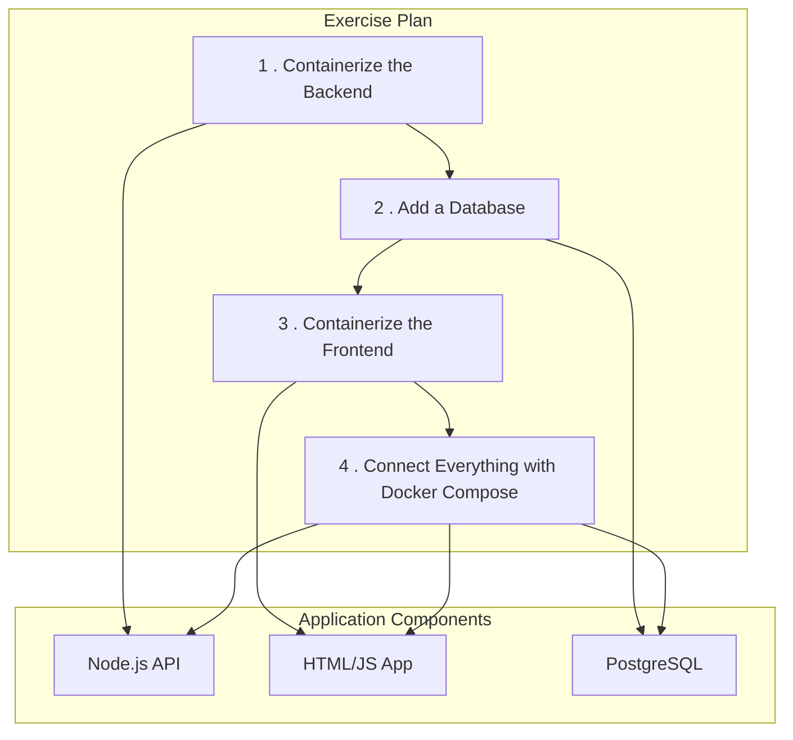

# Docker Exercises Plan

This document outlines the plan for creating a set of Docker exercises for beginners. The goal is to provide hands-on experience with containerizing a multi-service application.

## Proposed Technology Stack

*   **Backend:** A simple Node.js/Express "To-Do" list API.
*   **Frontend:** A basic HTML/CSS/JavaScript application that interacts with the backend API.
*   **Database:** A PostgreSQL database to store the to-do items.

## Exercise Structure

The exercises will guide the student through containerizing and connecting the different parts of the application.

### Exercise Breakdown:

1.  **Backend First:** Start with the Node.js backend. The student's first task will be to write a `Dockerfile` to containerize this application.
2.  **Adding the Database:** Introduce the PostgreSQL database. The student will learn how to run a database as a container and connect the backend container to it. This will cover Docker networking basics.
3.  **Frontend Integration:** Provide the frontend code. The student will write another `Dockerfile` to containerize the frontend application.
4.  **Orchestration with Docker Compose:** Finally, the student will create a `docker-compose.yml` file to define and run the multi-container application (frontend, backend, database) with a single command.